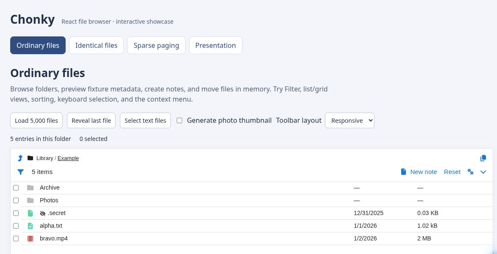

<p align="center">
    
    <br />
    <a href="https://www.npmjs.com/package/@samuelncui/chonky">
        
    </a>
    <a href="https://tldrlegal.com/license/mit-license">
        
    </a>
    <br />
    <br />
    <br />
</p>

Chonky is a file browser component for React. It tries to recreate the native file
browsing experience in your browser. This means your users can make selections, drag
& drop files, toggle between _List_ and _Grid_ file views, use keyboard shortcuts, and
much more!

This is a maintained fork of [Chonky] by [TimboKZ].

[Chonky]: https://github.com/TimboKZ/Chonky
[TimboKZ]: https://github.com/TimboKZ



### [Live Demo →](https://samuelncui.github.io/Chonky/)

## Why this fork

The upstream project is no longer actively maintained. This fork keeps Chonky
usable in current React applications by updating its framework dependencies,
replacing retired libraries, fixing integration issues, and improving large
directory performance. The packages use the `@samuelncui` scope so applications
can adopt the maintained fork explicitly.

See the [changelog](./CHANGELOG.md) before upgrading from an earlier release.

## Requirements

- React and React DOM 19.2.x
- Node.js 22.12 or later

## Usage

Add the forked npm packages:

```shell
npm install @samuelncui/chonky @samuelncui/chonky-icon-fontawesome
```

Add to your app:

```typescript
import { FullFileBrowser } from '@samuelncui/chonky';
import { ChonkyIconFA } from '@samuelncui/chonky-icon-fontawesome';

export function MyComponent() {
  return <FullFileBrowser files={[]} darkMode iconComponent={ChonkyIconFA} />;
}
```

See the runnable [example](./packages/chonky/example) and the
[`@samuelncui/chonky` package documentation](./packages/chonky/README.md).
The upstream [Chonky documentation](https://chonky.io/) remains useful for
general concepts, but APIs and compatibility may differ from this fork.

> Please [create an issue](https://github.com/samuelncui/Chonky/issues) if you have a
> problem or want to request a feature.

## Local demo

```shell
pnpm install --frozen-lockfile
pnpm build
pnpm --filter @samuelncui/chonky-example dev
```

After starting the local server, open `http://127.0.0.1:4173/`.
Its navigation covers ordinary files,
grouped files, sparse paging, and presentation extensions. All fixtures and
operations stay in browser memory and can be reset.
See [grouped-list integration](./packages/chonky/README.md#grouped-lists)
for the API and selection semantics. Rebuild the packages after library changes;
the demo consumes their built exports.

Run `pnpm check` and `pnpm e2e` for static, unit and browser verification.
Run `pnpm e2e:pages` to build and test the static demo under its deployed
`/Chonky/` path. The Demo workflow deploys that tested output to GitHub Pages
after a push to `master`, or a manual dispatch.

## License

MIT © Samuel N Cui. 2023

MIT © [Aperture Robotics, LLC.](https://github.com/aperturerobotics/react-chonky) 2023

MIT © [Tim Kuzhagaliyev](https://github.com/TimboKZ) 2020
